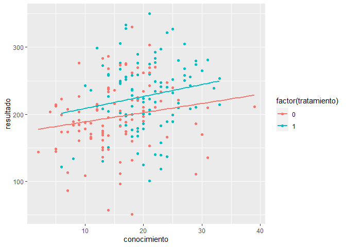

Introducción a la evaluación de impacto
================

# Introducción

El desafío de la evaluación de impacto de determinar el efecto causal de
una condición de tratamiento respecto a una variable de interés. En
definitiva, nos gustaría poder contestar la pregunta ¿en cuánto se
beneficia una persona X en recibir el tratamiento respecto al caso en
que no recibiera el tratamiento? Si esta pregunta pudiera ser
respondida, se contaría con muy buena evidencia del efecto que un
tratamiento tiene sobre alguien. Sin embargo, no es posible responder a
esta pregunta directamente, ya que una persona no puede ser parte de una
condición de tratamiento, y, al mismo tiempo, no ser parte de este.

En su lugar, la evaluación de impacto busca estimar el efecto promedio
\[Average treatment effect (ATE)\], a través de la comparación de los
resultados del grupo tratado, respecto a un grupo no tratado. Ese grupo
no tratado se construye, guiado por el contrafactual. ¿Qué es el contra
factual?

## Modelo básico:

Formalmente se describe de la siguiente forma:

$$ ATE =E(Y(1)|D=1) - E(Y(0)|D=1) $$ Esto es, que el efecto promedio del
programa es la diferencia entre el promedio del grupo tratado y el mismo
grupo de personas, pero bajo la condición de que no ha sido tratado. A
este grupo hipotético se le llama contrafactual. Como esto no es posible
de observar el resultado contrafactual, lo que se hace es buscar un
grupo alternativo que reemplaza al grupo tratado bajo la condición
hipotética de que no ha sido tratado. Este grupo se le llama grupo
control, y debe tener la característica de que

$$ E(Y(0)|D=1) = E(Y(0)|D=0) $$

Si ese es el caso, entonces es posible estimar el efecto promedio del
programa, al calcular la diferencia entre la variable resultado del
grupo tratado y un grupo control, cuyo promedio en la variable resultado
sería igual al del grupo tratado bajo la condición hipotética de que no
ha sido tratado (contrafactual).

## Condiciones para que se pueda estimar el modelo:

El modelo de regresión ayuda a formalizar los requerimientos y supuestos
del modelo. El modelo básico se puede escribir de la siguiente forma:

$$ y_i = \beta_0 + \beta_1D + u_i $$

Donde D corresponde a la condición de tratamiento. D = 0 cuando no se
particia en la condición de tratamiento y D = 1 cuando sí se participa.
Lo más relevante es que se cumpla con el supuesto de independencia
condicional. Esto es que:

$$ E(u_i|D_i) = 0 $$

Esto es que no existe ninguna asociación entre participar y no
participar en la condición de tratamiento y variables observadas (como
el género) y no observadas (como las actitudes y creencias). En otra
palabras, si el grupo tratado y el no tratado es identico en la
distribución de sus características, entonces las diferencias
encontradas en la variable de resultado será producto de la
intervención.

## Variables de confusión:

Son variables que afectan la probabilidad de ser parte del grupo
tratado, como también la variable resultado. Esto, en términos simples,
ocurre cuando existen diferencias en los grupos en variables que tienen
un efecto final en el resultado. En el ámbito educativo, ocurriría en el
caso de que el grupo tratado, por ejemplo, se componga de estudiantes
con mejor desempeño que el grupo no tratado. Si la variable resultado es
desempeño, al final del año, se observarían diferencias en la variable
de resultado incluso en ausencia del tratamiento. Formalmente, la
diferencia contendría los siguientes términos:

$$ E(Y(1)|D=1) - E(Y(0)|D=0) = ATE + E(Y_0|D=1) - E(Y_0|D=0) $$

La diferencia de promedios, en este caso, no solo indicaría el efecto
promedio, sino que también las diferencias existentes previo al
tratamiento. Incluso, si no hubiese habido tratamiento, el grupo tratado
hubiese tenido un mejor desempeño debido a su composición.

En este caso el estimador de tratamiento $\beta_1$ es sesgado. Es decir,
no converge al efecto real, sino que a otro valor, que puede ser mayor o
menor dependiendo del tipo de variables de confusión que existan y en
qué grupo se concentren.

# Caso de ejemplo:

Vamos a simular el caso de la evaluación de un programa, que consiste en
acompañar a un colegio a través de asesorías. Queremos ver qué impacto
tienen las asesorías en los aprendizajes de los estudiantes. Para ello
vamos a simular una situación, en donde el puntaje de un estudiante
depende de:

$$ y_i = \beta_0 + \beta_1D_i + \beta_2C_i + \beta_3A_i + u_i    $$

Donde D es la condición de tratamiento, C es el conocimiento previo, A
es la asistencia y u es todo aquello que influye y para lo cual no se
tienen datos.

``` r
set.seed(123)
n1 = 100
n2 = 100
tratamiento = c(rep(1,n1),rep(0,n2))
conocimiento = c(round(rnorm(n1,20,6)), round(rnorm(n2,16,7)))
asistencia = c(round(runif(n1,min = 90, max = 100)),round(runif(n2,min = 83, max = 100)))
sim = data.frame(cbind(tratamiento, conocimiento, asistencia))
simz = sim %>% mutate(across(.cols = 2:3, .fns = function(x){scale(x)[,1]}))
Puntaje_final = 200 + tratamiento*20 + simz$conocimiento*15 + simz$asistencia*10 + rnorm(200,0,50)
sim$resultado = round(Puntaje_final,2)
sim %>% group_by(tratamiento) %>% summarise(promedio_conocimiento = mean(conocimiento),
                                            promedio_asistencia = mean(asistencia),
                                            promedio_resultado = mean(resultado))
```

    ## # A tibble: 2 x 4
    ##   tratamiento promedio_conocimiento promedio_asistencia promedio_resultado
    ##         <dbl>                 <dbl>               <dbl>              <dbl>
    ## 1           0                  15.3                91.9               196.
    ## 2           1                  20.6                94.8               228.

``` r
sim %>% ggplot(aes(x=conocimiento, y=resultado, color=factor(tratamiento))) + geom_point() + geom_smooth(method = "lm", se=F)
```

    ## `geom_smooth()` using formula = 'y ~ x'

<!-- -->

### Modelo 1:

``` r
lm1 = lm(resultado~tratamiento, data=sim)
summary(lm1)
```

    ## 
    ## Call:
    ## lm(formula = resultado ~ tratamiento, data = sim)
    ## 
    ## Residuals:
    ##      Min       1Q   Median       3Q      Max 
    ## -144.783  -28.925    0.624   31.646  134.687 
    ## 
    ## Coefficients:
    ##             Estimate Std. Error t value Pr(>|t|)    
    ## (Intercept)  195.963      5.237   37.42  < 2e-16 ***
    ## tratamiento   31.556      7.407    4.26 3.15e-05 ***
    ## ---
    ## Signif. codes:  0 '***' 0.001 '**' 0.01 '*' 0.05 '.' 0.1 ' ' 1
    ## 
    ## Residual standard error: 52.37 on 198 degrees of freedom
    ## Multiple R-squared:  0.08397,    Adjusted R-squared:  0.07935 
    ## F-statistic: 18.15 on 1 and 198 DF,  p-value: 3.153e-05

### Modelo 2:

``` r
lm2 = lm(resultado~tratamiento+conocimiento, data=sim)
summary(lm2)
```

    ## 
    ## Call:
    ## lm(formula = resultado ~ tratamiento + conocimiento, data = sim)
    ## 
    ## Residuals:
    ##      Min       1Q   Median       3Q      Max 
    ## -148.937  -30.487    0.256   33.810  130.533 
    ## 
    ## Coefficients:
    ##              Estimate Std. Error t value Pr(>|t|)    
    ## (Intercept)  172.5218    10.4946  16.439  < 2e-16 ***
    ## tratamiento   23.4771     7.9543   2.951  0.00355 ** 
    ## conocimiento   1.5331     0.5975   2.566  0.01103 *  
    ## ---
    ## Signif. codes:  0 '***' 0.001 '**' 0.01 '*' 0.05 '.' 0.1 ' ' 1
    ## 
    ## Residual standard error: 51.65 on 197 degrees of freedom
    ## Multiple R-squared:  0.1136, Adjusted R-squared:  0.1046 
    ## F-statistic: 12.62 on 2 and 197 DF,  p-value: 6.944e-06

### Modelo 3:

``` r
lm3 = lm(resultado~tratamiento+conocimiento+asistencia, data=sim)
summary(lm3)
```

    ## 
    ## Call:
    ## lm(formula = resultado ~ tratamiento + conocimiento + asistencia, 
    ##     data = sim)
    ## 
    ## Residuals:
    ##      Min       1Q   Median       3Q      Max 
    ## -139.531  -29.274    2.898   32.360  131.455 
    ## 
    ## Coefficients:
    ##              Estimate Std. Error t value Pr(>|t|)   
    ## (Intercept)  -54.4397    80.8724  -0.673  0.50164   
    ## tratamiento   16.3227     8.2153   1.987  0.04833 * 
    ## conocimiento   1.4896     0.5873   2.536  0.01199 * 
    ## asistencia     2.4777     0.8757   2.830  0.00515 **
    ## ---
    ## Signif. codes:  0 '***' 0.001 '**' 0.01 '*' 0.05 '.' 0.1 ' ' 1
    ## 
    ## Residual standard error: 50.76 on 196 degrees of freedom
    ## Multiple R-squared:  0.1484, Adjusted R-squared:  0.1354 
    ## F-statistic: 11.38 on 3 and 196 DF,  p-value: 6.476e-07
